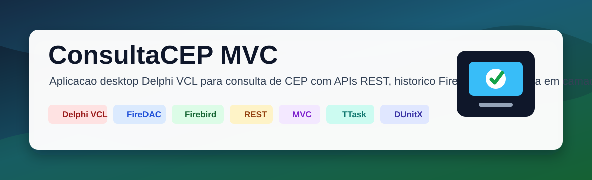
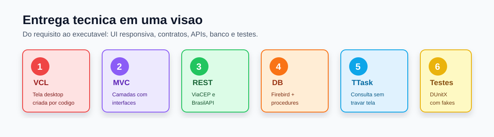
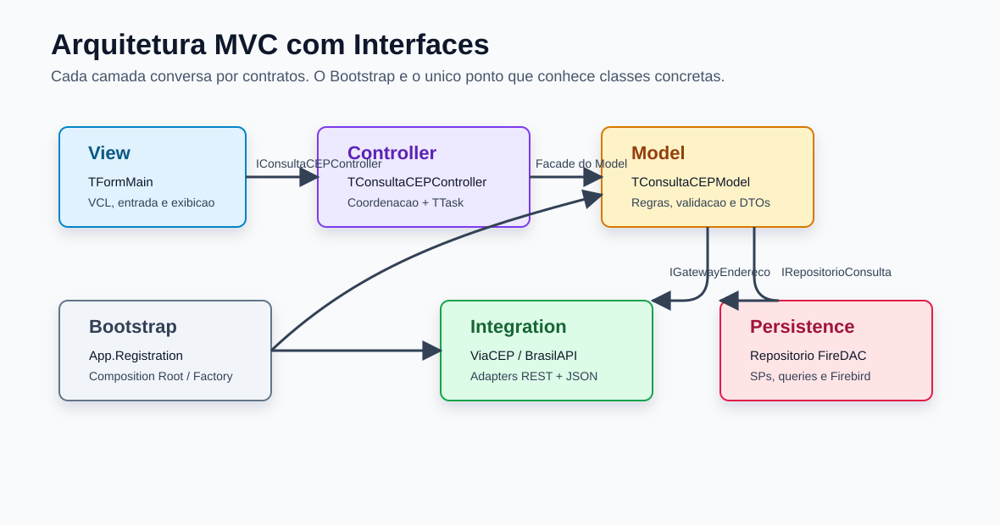
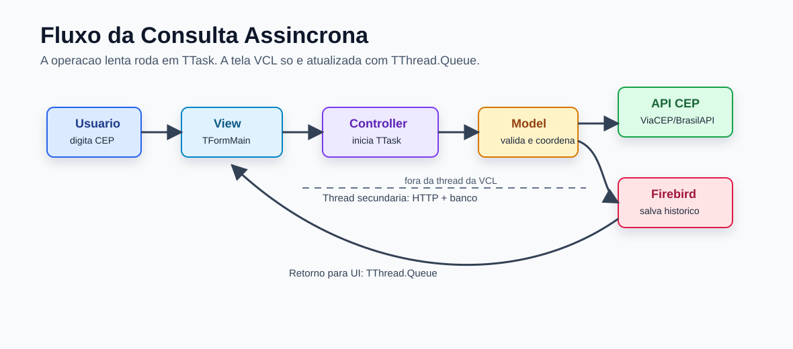
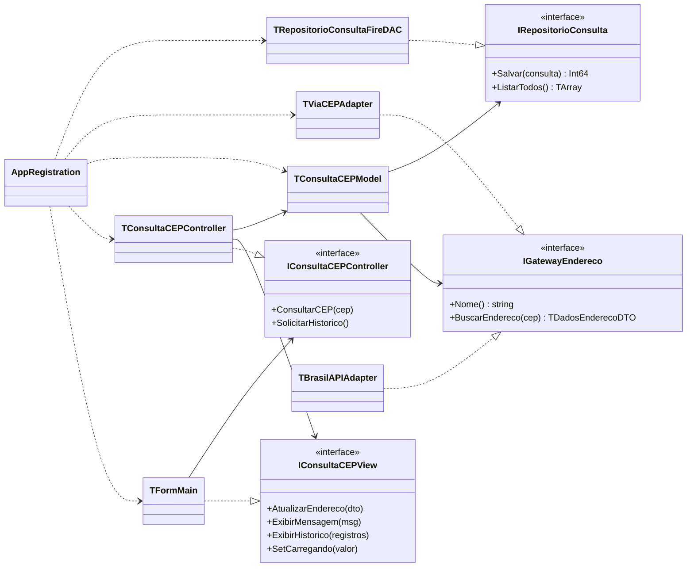
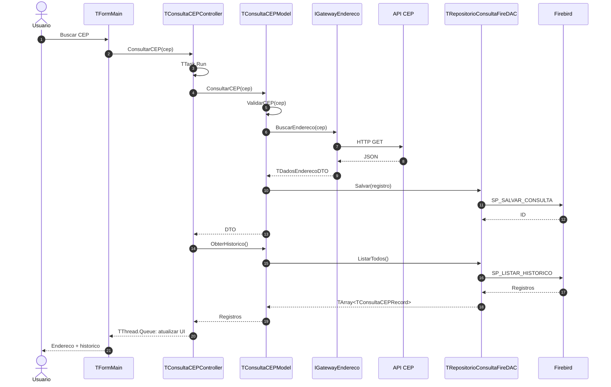
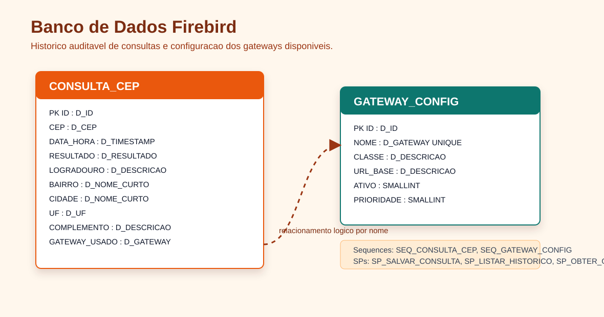

# ConsultaCEP MVC




Aplicação desktop em **Delphi VCL** para consultar endereços brasileiros a partir de um CEP, consumir APIs REST externas, manter a interface responsiva com `TTask` e persistir o histórico completo em **Firebird**.

O projeto foi construído do zero seguindo **Processo Unificado**, com concepção, elaboração, arquitetura MVC, padrões GRASP/GoF, banco relacional, testes unitários e separação por contratos.



## Identidade Visual

<table>
  <tr>
    <td bgcolor="#fee2e2"><b>Delphi VCL</b><br>Interface desktop e formulário principal.</td>
    <td bgcolor="#ede9fe"><b>MVC</b><br>Separação entre View, Controller e Model.</td>
    <td bgcolor="#dcfce7"><b>REST</b><br>Gateways ViaCEP e BrasilAPI por adapters.</td>
  </tr>
  <tr>
    <td bgcolor="#ffedd5"><b>Firebird</b><br>Histórico, procedures, triggers e domains.</td>
    <td bgcolor="#e0f2fe"><b>TTask</b><br>Consulta assíncrona sem congelar a tela.</td>
    <td bgcolor="#fef9c3"><b>DUnitX</b><br>Testes unitários com fakes e sem infraestrutura externa.</td>
  </tr>
</table>

## Visão Geral

| Item | Descrição |
|---|---|
| **Objetivo** | Consultar CEPs, exibir endereço e gravar histórico auditável. |
| **Interface** | Aplicação desktop VCL com formulário criado por código. |
| **Banco** | Firebird com domains, sequences, triggers, stored procedures e view. |
| **APIs** | ViaCEP como gateway principal e BrasilAPI como alternativa. |
| **Arquitetura** | MVC com interfaces entre View, Controller, Model, Integration e Persistence. |
| **Responsividade** | Consulta e histórico em background com `TTask`; atualização da VCL via `TThread.Queue`. |
| **Testes** | DUnitX com fakes para testar o Model sem internet, banco ou tela. |

## Funcionalidades

| Funcionalidade | Status | Resultado |
|---|---:|---|
| Validar CEP com 8 dígitos numéricos | `entregue` | Bloqueia CEP inválido antes da API. |
| Consultar endereço na ViaCEP | `entregue` | Retorna logradouro, bairro, cidade, UF e complemento. |
| Suportar BrasilAPI | `entregue` | Adapter alternativo implementado. |
| Persistir histórico | `entregue` | Registra sucesso, CEP não encontrado e erro de API. |
| Visualizar histórico | `entregue` | Grid com consultas ordenadas por data/hora desc. |
| Evitar travamento da tela | `entregue` | Operações lentas executadas em thread. |
| Testar regra de negócio | `entregue` | Testes DUnitX com fakes. |

## Requisitos

| Categoria | Requisito |
|---|---|
| **IDE** | Delphi 10.x ou superior, com VCL e FireDAC. |
| **Banco** | Firebird 3.0+ recomendado, character set UTF8. |
| **Cliente DB** | `isql` para criação e execução do script DDL. |
| **Rede** | Acesso à internet para consultar ViaCEP ou BrasilAPI. |
| **Testes** | DUnitX disponível no path de bibliotecas do Delphi. |

## Arquitetura



### Camadas

| Camada | Pasta | Responsabilidade |
|---|---|---|
| **Domain** | `Source/Domain` | Interfaces, DTOs, records e enumerações. |
| **Model** | `Source/Model` | Validação, regras de negócio e coordenação do fluxo. |
| **Controller** | `Source/Controller` | Recebe ações da View, executa TTask e atualiza a tela. |
| **View** | `Source/View` | Formulário VCL, entrada do usuário e exibição dos resultados. |
| **Integration** | `Source/Integration` | Adapters REST para ViaCEP e BrasilAPI. |
| **Persistence** | `Source/Persistence` | Repositório FireDAC/Firebird. |
| **Bootstrap** | `Source/Bootstrap` | Composition Root: cria e conecta as classes concretas. |

### Contratos Principais

| Interface | Implementação | Papel |
|---|---|---|
| `IConsultaCEPView` | `TFormMain` | Atualizar tela, mensagens, histórico e estado de carregamento. |
| `IConsultaCEPController` | `TConsultaCEPController` | Operações `ConsultarCEP` e `SolicitarHistorico`. |
| `IGatewayEndereco` | `TViaCEPAdapter`, `TBrasilAPIAdapter` | Busca polimórfica de endereço em APIs externas. |
| `IRepositorioConsulta` | `TRepositorioConsultaFireDAC` | Salvar e listar consultas no Firebird. |

## Fluxo da Consulta



1. O usuário digita o CEP e aciona **Buscar**.
2. A View chama o Controller via `IConsultaCEPController`.
3. O Controller desabilita a tela e inicia `TTask.Run`.
4. O Model valida o CEP, chama o gateway e tenta salvar o histórico.
5. O repositório executa stored procedures no Firebird.
6. A tela é atualizada com segurança via `TThread.Queue`.

## Diagramas UML

### Diagrama de Classe



### Diagrama de Sequência



## Banco de Dados



O banco fica em:

```text
Database/CONSULTACEP_MVC.FDB
```

Script principal:

```text
SQL/ConsultaCEP.Firebird.ddl.sql
```

### Tabelas

| Tabela | Finalidade |
|---|---|
| `CONSULTA_CEP` | Histórico de consultas, incluindo CEP, data/hora, resultado, endereço e gateway usado. |
| `GATEWAY_CONFIG` | Gateways disponíveis, URL base, classe Delphi, ativação e prioridade. |

### Objetos Firebird

| Tipo | Objetos |
|---|---|
| **Domains** | `D_ID`, `D_CEP`, `D_RESULTADO`, `D_DESCRICAO`, `D_NOME_CURTO`, `D_UF`, `D_GATEWAY`, `D_TIMESTAMP` |
| **Sequences** | `SEQ_CONSULTA_CEP`, `SEQ_GATEWAY_CONFIG` |
| **Triggers** | `TRG_CONSULTA_CEP_BI`, `TRG_GATEWAY_CONFIG_BI` |
| **Stored Procedures** | `SP_SALVAR_CONSULTA`, `SP_LISTAR_HISTORICO`, `SP_OBTER_GATEWAY_ATIVO` |
| **View** | `VW_HISTORICO_CONSULTAS` |

### Criação via isql

```sql
CREATE DATABASE 'C:\Users\Leand\OneDrive\Documentos\Embarcadero\Studio\Projects\delphi\ConsultaCEP_MVC\Database\CONSULTACEP_MVC.FDB'
PAGE_SIZE 16384
DEFAULT CHARACTER SET UTF8;
```

Depois execute:

```bat
isql -ch UTF8 -user SYSDBA -password masterkey Database\CONSULTACEP_MVC.FDB -i SQL\ConsultaCEP.Firebird.ddl.sql
```

## Padrões Aplicados

| Elemento | Padrões | Benefício |
|---|---|---|
| `TFormMain` | MVC View, Coesão Alta | Tela sem regra de negócio. |
| `TConsultaCEPController` | MVC Controller, GRASP Controller | Coordena casos de uso e thread. |
| `TConsultaCEPModel` | Facade, Expert, Creator | Centraliza regras de negócio e simplifica uso pelo Controller. |
| `IGatewayEndereco` | Strategy, Protected Variations | Troca de API sem alterar o Model. |
| `TViaCEPAdapter` / `TBrasilAPIAdapter` | Adapter, Strategy | Traduz JSON externo para DTO interno. |
| `TRepositorioConsultaFireDAC` | Repository, Pure Fabrication | Isola FireDAC e SQL do domínio. |
| `App.Registration` | Factory, Composition Root | Único ponto que conhece classes concretas. |

## Regras de Negócio

| Código | Regra |
|---|---|
| `RN01` | CEP válido possui exatamente 8 dígitos numéricos. |
| `RN02` | Toda consulta enviada ao gateway deve ser registrada no histórico. |
| `RN03` | CEP inválido não é registrado, pois é rejeitado antes da API. |
| `RN04` | Falha ao salvar histórico não deve impedir a exibição do resultado. |
| `RN05` | Falha de API deve gerar DTO de erro e mensagem amigável ao usuário. |

## Estrutura do Projeto

```text
ConsultaCEP_MVC/
├─ ConsultaCEP_MVC.dpr
├─ ConsultaCEP_MVC.dproj
├─ Database/
│  └─ CONSULTACEP_MVC.FDB
├─ SQL/
│  └─ ConsultaCEP.Firebird.ddl.sql
├─ Source/
│  ├─ Bootstrap/
│  │  └─ App.Registration.pas
│  ├─ Controller/
│  │  └─ ConsultaCEP.Controller.pas
│  ├─ Domain/
│  │  ├─ ConsultaCEP.DTO.pas
│  │  └─ ConsultaCEP.Interfaces.pas
│  ├─ Integration/
│  │  ├─ ConsultaCEP.Gateway.BrasilAPI.pas
│  │  └─ ConsultaCEP.Gateway.ViaCEP.pas
│  ├─ Model/
│  │  └─ ConsultaCEP.Model.pas
│  ├─ Persistence/
│  │  └─ ConsultaCEP.Repository.FireDAC.pas
│  └─ View/
│     └─ ConsultaCEP.View.Main.pas
└─ Tests/
   ├─ ConsultaCEP.Tests.dpr
   └─ ConsultaCEP.Tests.Model.pas
```

## Execução

1. Abra `ConsultaCEP_MVC.dpr` no Delphi.
2. Confirme que o Firebird está instalado e ativo.
3. Garanta que `Database/CONSULTACEP_MVC.FDB` existe ou crie pelo `isql`.
4. Compile e execute o projeto.
5. Digite um CEP com 8 números e clique em **Buscar**.

## Testes DUnitX

Projeto de testes:

```text
Tests/ConsultaCEP.Tests.dpr
```

Cobertura implementada:

| Teste | Verifica |
|---|---|
| `CEPInvalidoNaoChamaGatewayNemRepositorio` | CEP inválido não chama API nem banco. |
| `CEPSucessoChamaGatewayESalvaHistorico` | Consulta válida chama gateway e salva histórico. |
| `ErroDeAPIEConvertidoEmDTOEPersistido` | Erro de API vira DTO de erro persistível. |
| `FalhaAoSalvarNaoImpedeRetornoDoDTO` | Falha de persistência não derruba a consulta. |

## Resultados Entregues

| Área | Resultado |
|---|---|
| **Concepção** | Objetivo, escopo, requisitos, riscos e casos de uso definidos. |
| **Elaboração** | Modelo de domínio, sequência, classe, camadas, pacotes e persistência definidos. |
| **Construção** | Aplicação Delphi VCL implementada em MVC com interfaces. |
| **Banco** | Firebird criado, DDL executado e histórico operacional. |
| **Qualidade** | Testes DUnitX e fakes para regras do Model. |
| **UX** | Tela responsiva durante consultas por uso de `TTask`. |

## Evoluções Futuras

| Ideia | Ganho |
|---|---|
| Selecionar gateway ativo diretamente pela tabela `GATEWAY_CONFIG` | Troca de API sem recompilar. |
| Adicionar retry e fallback automático ViaCEP → BrasilAPI | Mais resiliência em falhas externas. |
| Criar Firebird Embedded opcional | Instalação mais simples em ambiente desktop. |
| Exportar histórico para CSV/PDF | Auditoria e suporte operacional. |
| Ampliar testes para Controller e Repository | Maior cobertura da arquitetura. |

---

**ConsultaCEP MVC** demonstra uma aplicação Delphi moderna, separada por responsabilidades, com persistência Firebird, integração REST, UI responsiva e base de testes unitários.
