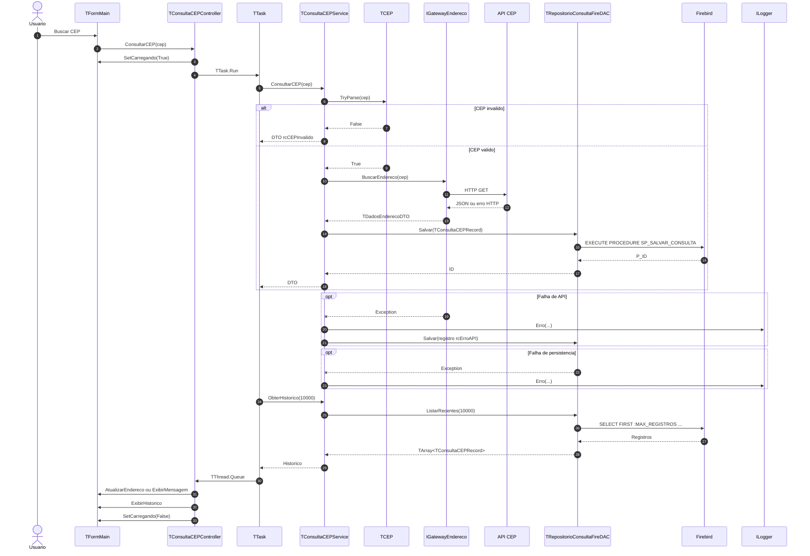

# ConsultaCEP MVC

Aplicacao desktop em Delphi VCL para consultar enderecos brasileiros a partir de um CEP, consumir APIs REST externas, manter a interface responsiva com `TTask` e persistir historico em Firebird.

## Visao Geral

| Item | Descricao |
|---|---|
| Interface | VCL com formulario em `.dfm` e handlers apenas delegando ao Controller. |
| Arquitetura | MVC com interfaces, Application Service e Pure DI no bootstrap. |
| Dominio | DTOs como records e value object `TCEP` para validacao. |
| APIs | `TViaCEPAdapter` como padrao e `TBrasilAPIAdapter` como alternativa via `.ini`. |
| Banco | Firebird 3.0+ com domains, sequence, tabela `CONSULTA_CEP` e SP de insert. |
| Threading | Controller dispara `TTask`; atualizacao de UI via `TThread.Queue`. |
| Testes | DUnitX com fakes, sem internet, banco ou VCL. |

## Requisitos Funcionais

| Codigo | Requisito | Implementacao |
|---|---|---|
| RF01 | Validar CEP com exatamente 8 digitos numericos. | `TCEP.TryParse` em `Source/Domain/ConsultaCEP.CEP.pas`. |
| RF02 | Consultar endereco via gateway externo. | `TViaCEPAdapter` e `TBrasilAPIAdapter`. |
| RF03 | Exibir logradouro, bairro, cidade, UF e complemento. | `TFormMain.AtualizarEndereco`. |
| RF04 | Informar CEP invalido, CEP nao encontrado e erro de API. | `TDadosEnderecoDTO.Resultado` e mensagens da View. |
| RF05 | Persistir consultas com sucesso, nao encontradas e erro de API. | `TConsultaCEPService.TentarSalvarHistorico`. |
| RF06 | Nao persistir CEP invalido. | Retorno antecipado no Service antes do gateway. |
| RF07 | Exibir historico em grid com registros recentes. | `SolicitarHistorico` + `ListarRecentes(10000)`. |
| RF08 | Permitir trocar gateway sem alterar as camadas. | `config/ConsultaCEP.ini`, chave `Gateway.Ativo`. |

## Requisitos Nao Funcionais

| Categoria | Requisito | Implementacao |
|---|---|---|
| Usabilidade | Campo de CEP aceita apenas digitos e limita a 8 caracteres. | `NumbersOnly=True`, `MaxLength=8` e handler `edtCEPKeyPress`. |
| Usabilidade | Enter no campo aciona a busca. | `edtCEPKeyPress` delega para `btnBuscarClick`. |
| Usabilidade | Botao e campo ficam bloqueados durante a consulta. | `IConsultaCEPView.SetCarregando`. |
| Confiabilidade | Falha de API nao trava a aplicacao. | Excecao capturada no Service e convertida em `rcErroAPI`. |
| Confiabilidade | Falha de banco nao impede exibir o resultado. | Excecao de persistencia e registrada no logger. |
| Desempenho | UI permanece responsiva. | Consulta e historico rodam em `TTask`. |
| Desempenho | Timeout HTTP de 10 segundos. | `ConnectionTimeout` e `ResponseTimeout` nos adapters. |
| Desempenho | Historico limitado para evitar carga sem controle. | `ListarRecentes(AMaxRegistros)` com `SELECT FIRST`. |
| Manutenibilidade | Camadas dependem de interfaces. | Contratos em `ConsultaCEP.Interfaces.pas`. |
| Testabilidade | Service testavel sem internet, banco ou tela. | DUnitX com fakes em `Tests/ConsultaCEP.Tests.Service.pas`. |

## Camadas

| Camada | Pasta | Responsabilidade |
|---|---|---|
| Domain | `Source/Domain` | Interfaces, DTOs, enum e `TCEP`. |
| Service | `Source/Service` | Valida CEP, chama gateway, monta registro e persiste. |
| Controller | `Source/Controller` | Coordena UI, `TTask` e retorno para a thread principal. |
| View | `Source/View` | Form VCL em `.dfm`, entrada do usuario e exibicao. |
| Integration | `Source/Integration` | Adapters REST ViaCEP e BrasilAPI. |
| Persistence | `Source/Persistence` | Repository FireDAC com factory de conexao por operacao. |
| Infra | `Source/Infra` | `TFileLogger` e `TNullLogger`. |
| Bootstrap | `Source/Bootstrap` | Composition Root e configuracao Pure DI. |

## Fluxo Ponto a Ponto


1. Usuario digita o CEP e aciona **Buscar** ou pressiona Enter.
2. `TFormMain` delega para `IConsultaCEPController.ConsultarCEP`.
3. `TConsultaCEPController` chama `SetCarregando(True)` e inicia um `TTask`.
4. No background, `TConsultaCEPService` valida o texto com `TCEP.TryParse`.
5. Se o CEP for invalido, o Service retorna `rcCEPInvalido` sem chamar API e sem salvar historico.
6. Se o CEP for valido, o Service chama `IGatewayEndereco.BuscarEndereco`.
7. O adapter executa HTTP GET, interpreta o JSON e devolve `TDadosEnderecoDTO`.
8. Em caso de excecao no gateway, o Service cria um DTO `rcErroAPI`.
9. Para sucesso, CEP nao encontrado ou erro de API, o Service monta `TConsultaCEPRecord`.
10. `TRepositorioConsultaFireDAC` abre uma conexao propria pela factory e executa `SP_SALVAR_CONSULTA`.
11. Se a persistencia falhar, o erro vai para `ILogger`, mas o DTO continua voltando para a tela.
12. O Controller busca o historico com `ObterHistorico(10000)`.
13. O Controller usa `TThread.Queue` para voltar para a thread principal.
14. A View atualiza endereco, mensagem, grid de historico e libera os controles.

## Diagrama de Sequencia



## Configuracao

O arquivo `config/ConsultaCEP.ini` controla o gateway ativo:

```ini
[Gateway]
Ativo=ViaCEP
```

Use `Ativo=BrasilAPI` para trocar o adapter sem alterar as camadas da aplicacao.

O banco padrao e procurado em `Database/CONSULTACEP_MVC.FDB`. Se precisar informar outro caminho, preencha:

```ini
[Database]
Path=C:\caminho\consultacep.fdb
```

## Banco

Script principal:

```text
SQL/ConsultaCEP.Firebird.ddl.sql
```

Objetos criados:

| Tipo | Objetos |
|---|---|
| Domains | `D_ID`, `D_CEP`, `D_RESULTADO`, `D_DESCRICAO`, `D_NOME_CURTO`, `D_UF`, `D_GATEWAY`, `D_TIMESTAMP` |
| Sequence | `SEQ_CONSULTA_CEP` |
| Tabela | `CONSULTA_CEP` |
| Stored procedure | `SP_SALVAR_CONSULTA` |
| Indices | CEP, data/hora e resultado |

Criacao via `isql`:

```bat
isql -ch UTF8 -user SYSDBA -password masterkey Database\CONSULTACEP_MVC.FDB -i SQL\ConsultaCEP.Firebird.ddl.sql
```

## Testes

Projeto de testes:

```text
Tests/ConsultaCEP.Tests.dpr
```

Cobertura implementada:

| Teste | Verifica |
|---|---|
| `TCEPTests` | CEP valido, curto, vazio e com letras. |
| `CEPInvalidoNaoChamaGatewayNemRepositorio` | CEP invalido nao chama API nem banco. |
| `CEPSucessoChamaGatewayESalvaHistorico` | Consulta valida chama gateway e salva historico. |
| `ErroDeAPIEConvertidoEmDTOEPersistido` | Excecao do gateway vira DTO `rcErroAPI` e e persistida. |
| `FalhaAoSalvarNaoImpedeRetornoDoDTO` | Falha de persistencia nao impede retorno para a tela. |

## Estrutura

```text
ConsultaCEP_MVC/
|-- ConsultaCEP_MVC.dpr
|-- ConsultaCEP_MVC.dproj
|-- config/
|   `-- ConsultaCEP.ini
|-- SQL/
|   `-- ConsultaCEP.Firebird.ddl.sql
|-- Source/
|   |-- Bootstrap/
|   |   `-- App.Registration.pas
|   |-- Controller/
|   |   `-- ConsultaCEP.Controller.pas
|   |-- Domain/
|   |   |-- ConsultaCEP.CEP.pas
|   |   |-- ConsultaCEP.DTO.pas
|   |   `-- ConsultaCEP.Interfaces.pas
|   |-- Infra/
|   |   `-- ConsultaCEP.Logger.pas
|   |-- Integration/
|   |   |-- ConsultaCEP.Gateway.BrasilAPI.pas
|   |   `-- ConsultaCEP.Gateway.ViaCEP.pas
|   |-- Persistence/
|   |   `-- ConsultaCEP.Repository.FireDAC.pas
|   |-- Service/
|   |   `-- ConsultaCEP.Service.pas
|   `-- View/
|       |-- ConsultaCEP.View.Main.dfm
|       `-- ConsultaCEP.View.Main.pas
`-- Tests/
    |-- ConsultaCEP.Tests.CEP.pas
    |-- ConsultaCEP.Tests.Service.pas
    |-- ConsultaCEP.Tests.dpr
    `-- ConsultaCEP.Tests.dproj
```
